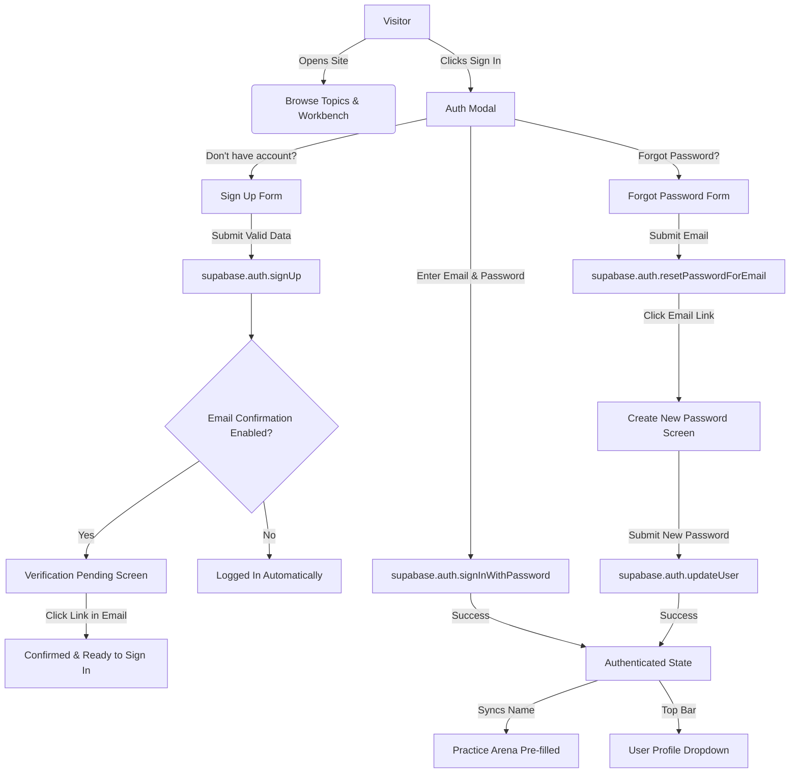

# HTML & CSS Tag Finder · Interactive Web Lab 🚀

[](https://developer.mozilla.org/en-US/docs/Web/HTML)
[](https://developer.mozilla.org/en-US/docs/Web/CSS)
[](https://developer.mozilla.org/en-US/docs/Web/JavaScript)
[](https://supabase.com/)
[](https://opensource.org/licenses/ISC)

> An interactive, hands-on learning lab and reference workbench for modern HTML5, CSS3 layout techniques, and full-stack Supabase authentication. Build, inspect, edit in real-time, test code challenges, and generate submission completion codes.

---

## 🌟 Overview

**Tag Finder** transforms static documentation into an interactive playground. Instead of memorizing syntax in isolation, learners select what they want to build, examine the required tags, toggle CSS properties line-by-line, inspect live browser results, test real website layouts with X-Ray mode, and verify their skills through graded practice challenges.

The project features a **complete, production-ready Supabase Email + Password Authentication system** with session persistence, profile management, email verification support, and password recovery.

---

## ✨ Features

### 🛠️ 1. Interactive Tag & CSS Workbench
- **104+ Curated Topics** organized across 13 foundational categories:
  - Text typography (`h1`–`h6`, `p`, `span`, `b`, `blockquote`)
  - Lists, Links & Navigation (`ul`, `ol`, `li`, `a`, relative anchor jumps)
  - Media & Embeds (`img`, `video`, `audio`, `iframe`)
  - Tables & Structured Data (`table`, `tr`, `td`, `th`, styling)
  - Forms & Inputs (`input`, `button`, `select`, `textarea`, labels)
  - Semantic Page Layouts (`header`, `nav`, `main`, `section`, `footer`)
  - Visual Styling (Box model, borders, shadows, rounded corners, transitions)
  - Modern Flexbox & Grid layouts
  - Positioning & Overlays (`relative`, `absolute`, `sticky`, `fixed`, z-index)
- **Step-by-Step Workbench**:
  1. **Which tag?**: Syntax chip and conceptual explanation.
  2. **Write HTML**: Live interactive editor with instant live-update preview.
  3. **Add CSS, one line at a time**: Toggle CSS declarations individually with customizable dropdown values to observe immediate visual effects.
  4. **See the result**: Live sandboxed iframe preview with Device Switcher (**Laptop** vs. **Phone** viewports).

### 🔍 2. Real Website X-Ray Mode
- Dissect a complete real-world e-commerce website (**CampusKart**).
- Click any section (header, logo, search bar, hero banners, product cards, floating help buttons) to reveal the underlying HTML tags, key CSS layout rules, and jump directly to related topics.

### 🏆 3. Practice Arena & Code Verification
- **28 Hands-on Challenges** covering HTML, CSS Basics, Flexbox, Grid, and Positioning.
- Real-time automated DOM and computed CSS validation.
- Generates authenticated **Completion Codes** based on student Roll Number and verification hashes for classroom assignments.

### 🌓 4. Dark & Light Theme System
- Built-in theme switcher in the topbar with smooth transitions.
- Respects OS system color scheme (`prefers-color-scheme`) by default.
- Persists user preferences in `localStorage`.
- High-contrast accessible color palette for both light and dark modes.

### 🔐 5. Full Supabase Email + Password Authentication
- **Secure Email/Password Sign Up**: Client-side validation, password length checks, and confirmation matching.
- **Email Verification Pending State**: Notifies learners when confirmation emails are sent with an on-demand resend button.
- **Sign In**: Fast login with accessible password visibility toggle (👁️).
- **Forgot & Reset Password Flow**: Automated recovery emails and a dedicated new password configuration screen.
- **Session Persistence**: Sessions persist securely across browser reloads via Supabase Auth tokens.
- **User Profile Menu**: Dropdown displaying avatar initials, full name, email, and one-click Sign Out.
- **Automatic Name Sync**: Logged-in learner names automatically populate the Practice Arena (`PS.name`) for seamless assignment tracking.

### 💾 6. Persistent Cloud User Data & Learning Progress
- **Supabase PostgreSQL as Source of Truth**: All student work (solved challenges, custom code solutions, workbench HTML edits, CSS line toggles, roll numbers, and preferences) is saved directly to Supabase PostgreSQL.
- **Cross-Device Persistence**: When a student logs out and logs back in with the same account days later or from a different computer, **all** of their work and learning progress is automatically restored.
- **Safe Logout**: Logging out terminates the session; it **never** deletes records from the database.
- **Automatic Debounced Saving**: Edits to the code and HTML editors are debounced (600–800ms) to prevent unnecessary network requests while ensuring work is never lost.
- **Subtle Save Status Badge**: Real-time topbar indicator displaying `● Saved`, `Saving...`, `Offline (cached)`, and `Syncing...`.
- **Row Level Security (RLS)**: Strict database-level isolation guarantees that students can only ever view and edit their own data (`auth.uid() = user_id`).
- **Offline Resilience Queue**: Changes made during brief disconnections are cached locally and synchronized automatically once the network returns.

---

## 📁 Project Structure

```text
HTML CSS Learning/
├── css/
│   ├── auth.css          # Authentication modal, forms, alerts, and save status badge styles
│   └── theme.css         # Light and Dark theme design tokens and surface transitions
├── docs/
│   └── user-data-persistence.md # Detailed database schema, RLS policies, and data flow documentation
├── js/
│   ├── auth.js           # Supabase Auth client methods (signup, signin, reset, session)
│   ├── auth-ui.js        # Authentication UI controller, modal states, validation, profile menu
│   ├── supabase.js       # Centralized Supabase client initialization
│   ├── theme.js          # Dark/Light mode theme state management & toggle listener
│   └── userDataService.js# Cloud persistence service, debouncing, offline queue & restore flow
├── supabase/
│   └── migrations/
│       └── 001_user_data_persistence.sql # Safe, repeatable SQL migration for tables & RLS
├── index.html            # Main single-page application (topics, editors, X-Ray, practice)
├── package.json          # Project scripts and dependencies
├── .gitignore            # Git ignore specifications
└── README.md             # Project documentation
```

---

## 🚀 Getting Started

### Prerequisites
- Any modern web browser (Google Chrome, Mozilla Firefox, Microsoft Edge, Safari).
- Node.js (version 18+ recommended) for running the local server.

### Local Development Setup

1. **Clone the repository:**
   ```bash
   git clone https://github.com/exobhavinss-sketch/Tailwind-css-jsintergration.git
   cd Tailwind-css-jsintergration
   ```

2. **Install dependencies:**
   ```bash
   npm install
   ```

3. **Start the local static server:**
   ```bash
   npm run dev
   ```

4. **Open in your browser:**
   ```text
   http://localhost:3000
   ```

> 💡 **Zero Build Step:** The application uses pure ES Modules and browser-standard import maps (`@supabase/supabase-js` via CDN). You can also run it with any static server such as Python's `python -m http.server 3000` or VS Code Live Server.

---

## ⚙️ Supabase Auth Configuration

The application is pre-configured to connect to the Supabase backend:

- **Project URL:** `https://ayoqassftnzqpomreqby.supabase.co`
- **Publishable Key:** Safe for client-side public browser usage (defined in [`js/supabase.js`](file:///f:/MIT%20VishwaPrayag%20University/3%20-%20Semester/Full%20Stack%20Development%20JS%20Intergration%20And%20Backend/HTML%20CSS%20Learning/js/supabase.js)).

### Setting Up Authentication in your Supabase Dashboard

To support email verification and password reset redirects for production (e.g. GitHub Pages) and local development:

1. Open your **[Supabase Dashboard](https://supabase.com/dashboard)**.
2. Navigate to **Authentication** → **URL Configuration**.
3. **Site URL:** Set to your deployed URL:
   ```text
   https://<username>.github.io/<repository-name>/
   ```
4. **Redirect URLs:** Add the following callback URLs:
   ```text
   http://localhost:3000/
   http://localhost:3000/**
   https://<username>.github.io/<repository-name>/
   https://<username>.github.io/<repository-name>/**
   ```
5. Navigate to **Authentication** → **Email Templates** to customize confirmation and recovery email content if desired.

### Running the Database Migration

To enable persistent cloud storage for user progress:

1. In your **[Supabase Dashboard](https://supabase.com/dashboard)**, go to the **SQL Editor**.
2. Click **New query**.
3. Copy and paste the contents of [`supabase/migrations/001_user_data_persistence.sql`](file:///f:/MIT%20VishwaPrayag%20University/3%20-%20Semester/Full%20Stack%20Development%20JS%20Intergration%20And%20Backend/HTML%20CSS%20Learning/supabase/migrations/001_user_data_persistence.sql).
4. Click **Run**.
5. All four tables (`profiles`, `practice_progress`, `workbench_progress`, `user_preferences`) will be created with Row Level Security (RLS) policies and performance indexes enabled.

---

## 🧪 Authentication Flow Details



---

## 🎨 Design Tokens & Custom Properties

The UI relies on standard CSS custom properties defined in [`index.html`](file:///f:/MIT%20VishwaPrayag%20University/3%20-%20Semester/Full%20Stack%20Development%20JS%20Intergration%20And%20Backend/HTML%20CSS%20Learning/index.html) and [`css/theme.css`](file:///f:/MIT%20VishwaPrayag%20University/3%20-%20Semester/Full%20Stack%20Development%20JS%20Intergration%20And%20Backend/HTML%20CSS%20Learning/css/theme.css):

| Variable | Light Theme | Dark Theme | Purpose |
| :--- | :--- | :--- | :--- |
| `--bg` | `#eef2f6` | `#0d131b` | Canvas background |
| `--panel` | `#ffffff` | `#141d28` | Cards, sidebars, modals |
| `--ink` | `#15202d` | `#e4ebf3` | Primary body text |
| `--muted` | `#586577` | `#95a3b5` | Secondary text, hints |
| `--line` | `#d6dde6` | `#263345` | Card and input borders |
| `--accent` | `#1f5fbf` | `#6ea8ff` | Primary brand accent |
| `--accent-ink` | `#ffffff` | `#0b1320` | Text on accent backgrounds |
| `--warn` | `#b4361f` | `#ff9a85` | Validation & error messages |

---

## 🚀 Deploying to Vercel (Recommended)

This project is pre-configured and optimized for **zero-configuration, high-performance deployment on Vercel**.

### Option A: Deploy via Vercel Dashboard (Fastest)

1. Push your changes to GitHub:
   ```bash
   git add .
   git commit -m "Optimize for Vercel deployment"
   git push origin main
   ```
2. Go to [vercel.com](https://vercel.com) and log in.
3. Click **Add New...** → **Project**.
4. Import your `HTML_CSS_Learning` repository.
5. In the project settings:
   - **Framework Preset**: *Other* (detected automatically)
   - **Root Directory**: `./` (default)
   - **Build Command**: `npm run build` (detected automatically)
   - **Output Directory**: `.` (default static root)
6. *(Optional)* If using custom Supabase credentials, add them under **Environment Variables**:
   - `NEXT_PUBLIC_SUPABASE_URL` or `SUPABASE_URL`
   - `NEXT_PUBLIC_SUPABASE_ANON_KEY` or `SUPABASE_ANON_KEY`
7. Click **Deploy**. Your site will be live on a `*.vercel.app` domain in seconds!

### Option B: Deploy via Vercel CLI

```bash
# Install Vercel CLI globally (if not already installed)
npm i -g vercel

# Deploy preview
vercel

# Deploy to production
vercel --prod
```

### ⚡ Vercel Optimizations Included:
- **`vercel.json`**:
  - Global security headers (`X-Content-Type-Options: nosniff`, `X-Frame-Options: SAMEORIGIN`, `Referrer-Policy`, `Permissions-Policy`).
  - Cache-Control headers for atomic HTML revalidation and cached JS/CSS assets.
  - SPA & deep-link rewrites (`/auth/callback`, `/xray`, `/practice`) back to `index.html`.
- **`.vercelignore`**: Excludes database migrations, docs, and development artifacts from upload bundles.
- **PWA & Manifest**: `site.webmanifest` and `favicon.svg` for crisp home-screen icons and rich social share cards.
- **Custom 404 Experience**: Dedicated, theme-aware [`404.html`](file:///f:/MIT%20VishwaPrayag%20University/3%20-%20Semester/Full%20Stack%20Development%20JS%20Intergration%20And%20Backend/HTML%20CSS%20Learning/404.html) matching the Tag Finder styling.

### ⚠️ Supabase Authentication Callback Configuration

To ensure Email confirmation, password reset links, and magic links work seamlessly on your live Vercel domain:
1. Open your [Supabase Dashboard](https://supabase.com/dashboard).
2. Navigate to **Authentication** → **URL Configuration**.
3. Under **Site URL**, set:
   `https://<your-project-name>.vercel.app`
4. Under **Redirect URLs**, click **Add URI** and add:
   `https://<your-project-name>.vercel.app/**`
5. Click **Save**.

---

## 🌐 Deploying to GitHub Pages

1. Commit and push your latest changes to the `main` branch:
   ```bash
   git add .
   git commit -m "Deploy Tag Finder with Email Auth"
   git push origin main
   ```
2. In your GitHub repository:
   - Go to **Settings** → **Pages**.
   - Under **Build and deployment** → **Source**, select **Deploy from a branch**.
   - Branch: `main` / Folder: `/ (root)`.
   - Click **Save**.
3. In a few minutes, your site will be live at:
   `https://<username>.github.io/<repository-name>/`

---

## 📄 License

This project is licensed under the [ISC License](file:///f:/MIT%20VishwaPrayag%20University/3%20-%20Semester/Full%20Stack%20Development%20JS%20Intergration%20And%20Backend/HTML%20CSS%20Learning/package.json).
